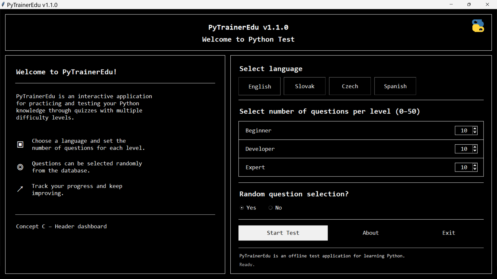

# PyTrainerEdu v1.1.0

**Offline Python training and quiz application**

PyTrainerEdu is a free, offline, MIT-licensed quiz application for learning and practicing Python. It supports multiple languages, multiple difficulty levels, random question selection, progress tracking, hints, explanations, and final reports.

<p align="center">
  
  <br>
  <em>PyTrainerEdu v1.1.0 main screen</em>
</p>

---

## Features

* Offline Python quiz application
* Graphical user interface and console version
* Multiple languages:

  * English
  * Slovak
  * Czech
  * Spanish
* Three difficulty levels:

  * Beginner
  * Developer
  * Expert
* Configurable number of questions per level
* Optional random question selection
* Hints and explanations
* Final report saved to the `reports/` folder
* Public release uses packed `.pte` data files instead of plain JSON question files

---

## Requirements

* Python 3.10 or newer
* Tkinter

Tkinter is included with most standard Python installations on Windows. On Linux, it may need to be installed separately depending on the distribution.

Example for Debian/Ubuntu:

```bash
sudo apt install python3-tk
```

---

## Run the GUI

### Windows helper

```bat
start_gui.bat
```

### Manual start

```bash
python pytrainer_gui.py
```

---

## Run the console version

```bash
python main.py
```

---

## Windows security warning

On Windows, the helper file `start_gui.bat` may show a warning such as **Unknown publisher**.

This happens because the project is not digitally signed with a paid code-signing certificate. PyTrainerEdu is free, open source, and MIT licensed, but unsigned helper scripts can still trigger Windows security warnings.

You can avoid using the batch file and start the program directly with Python:

```powershell
python pytrainer_gui.py
```

or run the console version:

```powershell
python main.py
```

This warning does not mean that the project contains malware. It only means that the helper script is not digitally signed by a commercial certificate authority.

---

## About `.pte` files

The public version does not include plain `questions_*.json` files.

Plain JSON files would expose the correct answers directly in a text editor, which would make the quiz too easy to bypass.

Instead, public question data is stored in packed `.pte` files inside:

```text
data_packed/
```

These `.pte` files are **not executable programs**. They are packed data files used by PyTrainerEdu. They contain:

* questions
* answer options
* correct answers
* accepted answers
* hints
* explanations
* interface text

The code that loads these files can be inspected here:

```text
data/loader.py
```

This is practical offline protection against casual answer browsing. It is not unbreakable DRM. If an application runs fully on a user's computer, a skilled programmer can eventually inspect or reverse the local data.

---

## Security note

PyTrainerEdu:

* does not require an internet connection
* does not need installation
* does not include hidden executable payloads in `.pte` files
* can be scanned by antivirus software
* can be inspected as open-source Python code
* can be run directly from source using Python

If you are unsure, inspect the source code and run the program manually with:

```bash
python pytrainer_gui.py
```

---

## Project structure

```text
PyTrainerEdu/
├── main.py                 # console version
├── pytrainer_gui.py        # graphical version
├── data/
│   └── loader.py           # data loader
├── data_packed/
│   ├── questions_sk.pte
│   ├── questions_cz.pte
│   ├── questions_en.pte
│   ├── questions_es.pte
│   ├── texts_sk.pte
│   ├── texts_cz.pte
│   ├── texts_en.pte
│   └── texts_es.pte
├── reports/                # generated reports
├── sessions/               # saved session state
├── python_logo_small.png
├── start_gui.bat
├── start_console.bat
├── LICENSE.txt
└── README.md
```

---

## Development data

The public package contains only packed `.pte` files.

The development package may contain editable JSON files and packing tools. Do not distribute the development package to students if you want to hide correct answers.

Recommended release package:

```text
PyTrainerEdu_v1.1.0.zip
```

Development package:

```text
PyTrainerEdu_v1.1.0_dev_data_tools.zip
```

---

## License

This project is released under the MIT License.

See:

```text
LICENSE.txt
```

---

## Credits

Developed and maintained by **Tibor Cefan**.

Assisted by **ChatGPT (Majka / SuPyWomen)**.

---

## Version

```text
PyTrainerEdu v1.1.0
```

---

## Note for teachers and students

PyTrainerEdu is designed as a small, offline learning tool. It is not a replacement for real programming practice. The best way to learn Python is to read the explanations, try the code yourself, and experiment.

The quiz can help you find weak spots, but Python only really starts to make sense when you write your own code.
